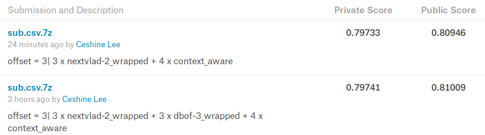

# 7th place solution to The 3rd YouTube-8M Video Understanding Challenge

A brief model summary can be found [here](https://www.kaggle.com/c/youtube8m-2019/discussion/112349). Please refer to the [workshop paper](Lee2019.pdf) for more details.

## 20191031 Update

- Redundant functions and classes have been removed.
- Some minor refactor.
- **Manage the models using YAML config files**: a YAML config file is used to specify the model architecture and training parameters. An exported model now consists of a YAML file and a pickled state dictionary.

**Correction to the paper** (and potential bugs): During the code cleanup, I found out that at near the end of competition, I set `num_workers=1` for train data loader when training segment classifiers. In the paper I wrote that I used `num_workers>1` to add more randomness. That was a mistake. In fact, using `num_workers>1` caused some convergence issue when I tried to reproduce the result. There might be some undiscovered bugs in the data loader. Using only one worker, although slower, should reproduce the results correctly.

### Model Reproduction

I've manage to reproduce the results with the cleaned codebase and Docker image (using some of the the remaining GCP credit). Two base models and seven segment classifiers are enough to obtain the 7th place:



Notes:

1. Because the data loader is reshuffled after each resumption from instance preemption, the base model cannot be exactly reproduced. The base model performs slightly worse this time (in terms of local CV results), and it affected the downstream models.
2. The Dockerized version seem to be slower. But your mileage may vary.
3. The training scripts under `/scripts` folder has been updated.

## System Environment

A conda [environment.yml](enviroment.yml) generated from running `conda env export` command is provided.

Special care: you need to install PyTorchHelperBot manually via `pip install PyTorchHelperBot/.`. (A copy of [PyTorch Helper Bot](https://github.com/ceshine/pytorch_helper_bot/) is included in this repo via Git subtree.)

Highlights:

- conda
  - python=3.7.4=h265db76_1
  - pytorch=1.3.0.dev20190909=py3.7_cuda10.0.130_cudnn7.6.2_0
- pip
  - tensorflow==2.0.0rc0
  - joblib==0.13.2
  - pandas==0.25.1
  - python-telegram-bot==12.0.0

Update: a Dockerfile and a public Docker images have been created for this project. Example usage:

```bash
docker run --gpus all \
    -v /path/to/segment/dataset:/home/docker/src/data/segment \
    -v /path/to/frame-level/video/dataset:/home/docker/src/data/video \
    --shm-size=1G -ti --name mycontainer \
    ceshine/yt8m-2019
```

**WARNING: The "video dataset" here is not "Video-level dataset", but "Frame-level dataset" on the download page. See Folder Structure section for more details.**

(Note: you need to install Docker and [NVIDIA/nvidia-docker](https://github.com/NVIDIA/nvidia-docker) first.)

## Folder Structure

- data
  - segment — Put the data from [YouTube-8M segment-rated frame-level features dataset](https://research.google.com/youtube8m/download.html) here.
    - train (please put the `validate` set here, as this dataset has no official training set.)
    - test
  - video — Put the data from [YouTube-8M **frame-level** features dataset](https://research.google.com/youtube8m/download.html) here.
    - train
      - Please check [train_file_list.txt](data/video/train/train_file_list.txt) for the list of shards used.
    - valid
      - Please check [valid_file_list.txt](data/video/train/valid_file_list.txt) for the list of shards used.
  - cache — generated files will be stored in this folder.
    - predictions — dumped `numpy.memmap` files during inference will be stored here.
    - video — pre-trained video-level models will be stored here.
    - segment — both context-aware and context-agnostic models will be stored here.
    - inference — when making competition submissions, logs will be stored here.
- yt8m — this is where the main code, include code that performs model pre-training, finetuning, and inference, resides.
- PyTorchHelperBot — a copy of [PyTorchHelperBot](https://github.com/ceshine/pytorch_helper_bot/). A simple high-level PyTorch wrapper I wrote for my personal use.

## Hardwares

I used both local comoputer and instances from Google Cloud Compute to train models and make inference.

My local computer:

- 1 Intel i7-7700K CPU
- 1 NVIDIA GTX 1070 GPU
- 16 GB RAM
- Linux Mint 19.2

Google Cloud Compute instance:

- 8 vCPU
- 20 GB RAM
- 1 NVIDIA Tesla T4 or 1 NVIDIA Tesla P100
- Debian 9

In addition to the disk space for the datasets, 100 GB extra space is needed for the `cache` folder.

Local computer can only be used to train context-agnostic models, make inference, and create submission files. Video-level model pre-training and context-aware models requries at least T4 to run.

### Time to train the models

The pre-training of the NeXtVLAD model took 15 hours on a Tesla P100 GPU. And the pre-training of a context-gated DBoF model took about 13 hours on a Tesla T4 GPU (this is a rough estimate from logs because the GCP instance was preempted several times during training).

The training/fine-tuning of context-agnostic models took 4 to 5 minutes per 1,000 steps for both NeXtVLAD and
context-gated DBoF models on a GTX 1070 GPU.

The training of context-aware models took 8 to 12 minutes per 1,000 steps on a Tesla T4 GPU.

## Reproduction Instructions

1. pretraining: `bash scripts/pretraning.bash`
2. finetuning context-agnostic models: `bash scripts/context-agnostic.bash`
3. finetuning context-aware models: `bash scripts/context-aware.bash`
4. prepare the metadata for the test set: `python -m yt8m.prepare_test_meta`
5. creating and dumping predictions to disk: `python -m yt8m.inference_memmap`
6. create submission file: `python -m yt8m.create_submission_from_memmaps`

The submission file will be create as `sub.csv` at the project root folder.

(if you have trained segment classifiers at hand, put them into `data/cache/segment` folder, and run step 4 to 6.)

## Troubleshooting

- **RuntimeError: received 0 items of ancdata**: [Increasing ulimit and file descriptors limit on Linux](https://glassonionblog.wordpress.com/2013/01/27/increase-ulimit-and-file-descriptors-limit/).
