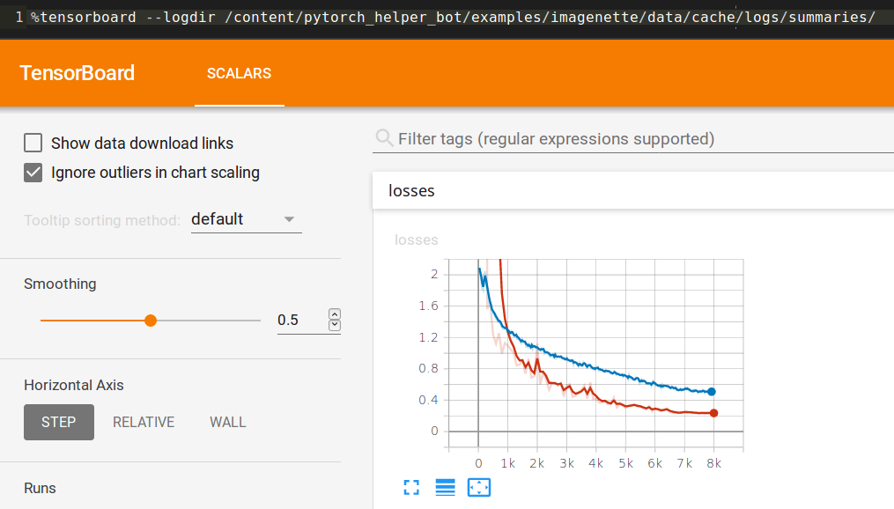

# Imagenette Example

## Preparation

Download the [imagenette dataset (full)](https://s3.amazonaws.com/fast-ai-imageclas/imagenette.tgz) and extract into `data` folder. It should now contains two folders: `train` and `val`.

## Training instructions

Run `python main.py -h` to view all the available arguments.

## Some Local Results

Hardware: i7-7700 + GTX 1070

| Size (px) | Epochs | Accuracy | Params | Arch | Log |
|--|--|--|--|--|--|
| 192 | 5 | 86.80% | `--batch-size 64 --lr 5e-3 --mixup-alpha 0` | seresnext50 | [bs64_8680.txt](logs/bs64_8680.txt) |
| 192 | 5 | 86.00% | `--batch-size 64 --lr 5e-3 --mixup-alpha 0.2` | seresnext50| [bs64_mixup02_8600.txt](logs/bs64_mixup02_8600.txt) |
| 192 | 10 | 89.80% | `--batch-size 64 --lr 5e-3 --mixup-alpha 0` | seresnext50| [bs64_e10.txt](logs/bs64_e10.txt) |

## Google Colab Results

[Notebook Link](https://colab.research.google.com/drive/1NppuVSUvNYIEfL7j3DEOKemhrdZFFPDg)

| Size (px) | Epochs | Accuracy | Params | Arch | Log | Amp | Time |
|--|--|--|--|--|--|--|--|
| 192 | 5 | 85.60% | `--batch-size 64 --lr 5e-3 --mixup-alpha 0` | seresnext50 | [colab_o0_bs64_e5.txt](logs/colab_o0_bs64_e5.txt) | | 13min 18s |
| 192 | 5 | 84.20% | `--batch-size 64 --lr 5e-3 --mixup-alpha 0 --amp O1` | seresnext50 | [colab_o1_bs64_e5.txt](logs/colab_o1_bs64_e5.txt) | O1 | 9min 59s |
| 192 | 5 | 85.80% | `--batch-size 64 --lr 5e-3 --mixup-alpha 0 --amp O1` | seresnext50 | [colab_o1_bs64_e5_2.txt](logs/colab_o1_bs64_e5_2.txt)* | O1 | 9min 47s |
| 192 | 5 | 85.40% | `--batch-size 64 --lr 5e-3 --mixup-alpha 0 --amp O2` | seresnext50 | [colab_o2_bs64_e5.txt](logs/colab_o2_bs64_e5.txt)* | O2 | 9min 35s |
| 192 | 20 | 93.40% | `--batch-size 64 --lr 3e-3 --mixup-alpha 0` | seresnext50 | [colab_o0_bs64_e20.txt](logs/colab_o0_bs64_e20.txt) | | 52min 50s |
| 192 | 20 | 92.40% | `--batch-size 64 --lr 3e-3 --mixup-alpha 0 --amp O1` | seresnext50 | [colab_o1_bs64_e20.txt](logs/colab_o1_bs64_e20.txt) | O1 | 39min 31s |
| 192 | 20 | 93.00% | `--batch-size 64 --lr 3e-3 --mixup-alpha 0 --amp O2` | seresnext50 | [colab_o2_bs64_e20.txt](logs/colab_o2_bs64_e20.txt)* | O2 | 38min 1s |
| 192 | 20 | 91.00% | `--batch-size 64 --lr 3e-3 --mixup-alpha 0` | densenet161 | [colab_o1_bs64_e20_dense161.txt](logs/colab_o1_bs64_e20_dense161.txt) | | 48min 44s |
| 192 | 40 | 94.40% | `--batch-size 64 --lr 3e-3 --mixup-alpha 0 --amp O1` | seresnext50 | [colab_o1_bs64_e40.txt](logs/colab_o1_bs64_e40.txt)* | O1 | 1h 16min 12s |
| 192 | 40 | 95.00% | `--batch-size 64 --lr 3e-3 --mixup-alpha .2 --amp O1` | seresnext50 | [colab_o1_bs64_e40_m20.txt](logs/colab_o1_bs64_e40_m20.txt)* | O1 | 1h 18min 3s |
| 192 | 40 | 94.00% | `--batch-size 64 --lr 3e-3 --mixup-alpha .2 --amp O1` | densenet161 | [colab_o1_bs64_e40_m20_dense161.txt](logs/colab_o1_bs64_e40_m20_dense161.txt)* | O1 | 1h 37min 54s |

*: Using the newer version where the weights of the entire network is explicitly initialized.

### Tensorboad Samples

From "[colab_o1_bs64_e40_m20_dense161.txt](logs/colab_o1_bs64_e40_m20_dense161.txt)" run:

Train and validation losses:

Learning rates:

Validation accuracy:

